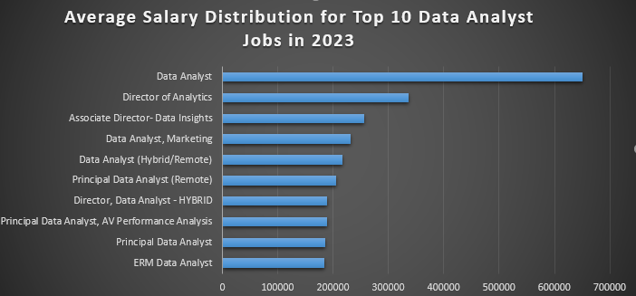
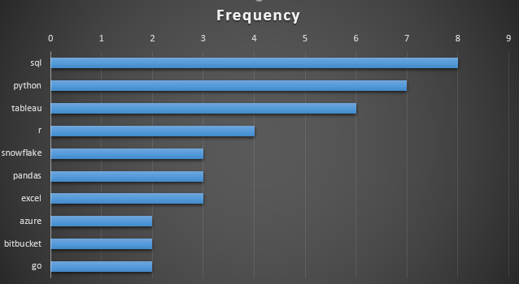

# Introduction
Dive into the data job market! Focusing on data analyst roles, this project explores top paying jobs, in-demand skills, and where high demands meets high salary in data analytics.
SQL Queries? Check them out here: [project_sql folder](/project_sql/)
# Background
Driven by a quest to navigate the data analyst job market more effectively, this project was born from a desire to pinpoint top-paid and in-demand skills streamlining others work to find optimal jobs.

Data hails from [datanerd.tech](https://www.datanerd.tech). It is packed with insights on job titles, salaries, locations and essential skills.
### The questions I wanted to answer through my SQL queries were:
1. What are the top-paying data analyst jobs?
2. What skillls are required for these top paying jobs?
3. What skills are most in-demand for data analysts?
4. Which skills are associated with higher salaries?
5. What are the most optimal skills to learn?
# Tools I used
For my deep dive into the data analyst job market, I harnessed the power of several key tools:
- **SQL:** The backbone of my analysis, allowing me to query the database and and unearth critical insights.
- **PostgreSQL:** The chosen database management system, ideal for handling the job posting data.
- **Visual Studio Code:** My go-to for database management and executing SQL queries.
- **Git & GitHub:** Essential for version control and sharing my SQL scripts and analysis, ensuring collaboration and project tracking.

# The analysis
Each query for this project aimed at investigating specific aspects of the data analyst job market. 
Here is how I approaced each question:
### 1. Top paying data analyst jobs.
To identify the highest paying roles, I filtered data analyst positions by average yearly salary and location, focusing on remote jobs. This query highlights the highest paying opportunities in the field.
```sql
SELECT 
    job_id,
    job_title,
    job_location,
    job_schedule_type,
    salary_year_avg,
    job_posted_date,
    name AS company_name
FROM
    job_postings_fact
LEFT JOIN company_dim ON job_postings_fact.company_id = company_dim.company_id
WHERE 
    job_title_short = 'Data Analyst' AND 
    job_location = 'Anywhere' AND 
    salary_year_avg IS NOT NULL
ORDER BY 
    salary_year_avg DESC
LIMIT 10
```
Here is the breakdown of the top data analyst jobs in 2023:
- **Wide Salary Range:** Top 10 paying data analyst roles span from $184,000 to $650,000 indicating significant salary potential in the field.
- **Diverse Employers:** Companies like SmartAsset, Meta, AT&T are among those offering high salaries showing a broad interest across different industries.
- **Job Title Variety:** There is a high diversity in job titles from Data Analyst to Director of Analytics, reflecting varied roles and specializatins within data analytics.


*Bar graph visualizing the salary for the top 10 salaries for data analysts*

### 2. Skills for Top Paying Jobs
To understand what skills are required for the top-paying jobs, I joined the job postings with the skills data, providing insights into what employers value for high copensation roles.
```sql
WITH top_paying_jobs AS(
    SELECT 
        job_id,
        job_title,
        salary_year_avg,
        name AS company_name
    FROM
        job_postings_fact
    LEFT JOIN company_dim ON job_postings_fact.company_id = company_dim.company_id
    WHERE 
        job_title_short = 'Data Analyst' AND 
        job_location = 'Anywhere' AND 
        salary_year_avg IS NOT NULL
    ORDER BY 
        salary_year_avg DESC
    LIMIT 10
)

SELECT 
    top_paying_jobs.*,
    skills
FROM top_paying_jobs
INNER JOIN skills_job_dim ON top_paying_jobs.job_id = skills_job_dim.job_id
INNER JOIN skills_dim ON skills_job_dim.skill_id = skills_dim.skill_id
ORDER BY
        salary_year_avg DESC;
```
Here is the breakdown of the most demanded skills for the top 10 highest paying data analyst jobs in 2023:
- **SQL**is leading with a bold count of 8.
- **Python** follows closely with a bold count of 7.
- **Tableau** is also highly sought after, witha bold count of 6. Other skills like **R**, **Snowflake**, **Pandas**, and **Excel** show varying degress of demand.


*Bar graph visualizing the count of skills for the top 10 paying jobs for data analysts.*

### 3. In-Demand Skills for Data Analysts.
This query helped identify the skills most frequently requested in job postings, directing focus to areas with high demand.
```sql
SELECT 
    skills,
    COUNT(skills_job_dim.job_id) AS demand_count
FROM job_postings_fact
INNER JOIN skills_job_dim ON job_postings_fact.job_id = skills_job_dim.job_id
INNER JOIN skills_dim ON skills_job_dim.skill_id = skills_dim.skill_id
WHERE
    job_title_short = 'Data Analyst' AND 
    job_work_from_home = True
GROUP BY 
    skills
ORDER BY 
    demand_count DESC
LIMIT 5;
```

Here is the breakdown for most demanded skills for data analysts in 2023:
- **SQL** and **Excel** remain fundamental, emphasizing the need fro strong foundational skills in data processing and spreadsheet manipulation.
- **Programming** and **Visualization tools** like **Python**, **Tableau** and **Power BI** are essential, pointing towards the increasing importance of technical skills in data story telling and decision support.

|Skills        |Demand  Count  |
|:---|---:|
|sql|7291|
|excel|4611|
|python|4330|
|tableau|3745|
power bi|2609|

*Table of the demand for the top 5 skills in data analyst job postings*
### 4. Skills Based on Salary.
Exploring the average salaries associated with different skills revealed which skills are the highest paying.
```sql
SELECT 
    skills,
    ROUND(AVG(salary_year_avg), 0) AS avg_salary
FROM job_postings_fact
INNER JOIN skills_job_dim ON job_postings_fact.job_id = skills_job_dim.job_id
INNER JOIN skills_dim ON skills_job_dim.skill_id = skills_dim.skill_id
WHERE
    job_title_short = 'Data Analyst' AND 
    salary_year_avg IS NOT NULL AND
    job_work_from_home = True
GROUP BY 
    skills
ORDER BY 
    avg_salary DESC
LIMIT 25;
```
 - **High Demand for Big Data & ML Skills:** Top salaries are commanded by analyst skilled in big data technologies (PySpark, Couchbase), machine lerarning tools (Data Robot, Jupyter) and Python libraries(Pandas, Numpy), reflecting the industries high valuation of data processing and predictive modelling capabilities.
- **Software Development & Deployment Proficiency:** Knowledge in development and deployment tools (GitLab, Kubernetes, Airflow) indicates a lucrative crossover between data analysis and engineering, with apremium on skills that facilitate automation and efficient data pipeline management.
- **Cloud Computing Expertise:** Familiarity with cloud and data engineering tools (Elastic Search, Databricks, GCP) underscores the growing importance of cloud-based ananlytics environments suggesting that cloud proficiency significantly boosts earning potential in data analytics.

|Skills|Average salary ($)|
|:---|---:|
|pyspark|208172|
|bitbucket|189155|
|couchbase|160515|
|watson|160515|
|datarobot|155486|
|gitlab|154500|
|swift|153750|
|jupyter|152777|
|pandas|151821|
|elasticsearch|145000|

*Table of the average salary for the top 10 paying skills*

### 5. Most Optimal Skills to Learn.
Combining insights from demand and salary data, this query aimed to pinpoint skills that are both in high demand and have high salaries.
```sql
SELECT 
    skills_dim.skill_id,
    skills_dim.skills,
    COUNT(skills_job_dim.job_id) AS demand_count,
    ROUND(AVG(job_postings_fact.salary_year_avg), 0) AS avg_salary
FROM job_postings_fact
INNER JOIN skills_job_dim ON job_postings_fact.job_id = skills_job_dim.job_id
INNER JOIN skills_dim ON skills_job_dim.skill_id = skills_dim.skill_id
WHERE
        job_title_short = 'Data Analyst'
        AND job_work_from_home = True
        AND salary_year_avg IS NOT NULL
GROUP BY
    skills_dim.skill_id
HAVING
    COUNT(skills_job_dim.job_id) > 10
ORDER BY
    avg_salary DESC,
    demand_count DESC
LIMIT 25;
```

|Skill ID|Skills|Demand Count|Average Salary ($)
|---|---|---|---:|
|8|go|27|115320|
|234|confluence|11|114210|
|97|hadoop|22|113193|
|80|Snowflake|37|112948|
|74|azure|34|111225|
|77|bigquery|13|109654|
|76|aws|32|108317|
|4|java|17|106906|
|194|ssis|12|106683|
|233|jira|20|104918|

*Table of the most optimal skills for data analysts sorted by salary*

Here is a breakdown of the most optimal skills for data analysts in 2023:
- **High-Demand Programming Languages:** **Python** and **R** stand out for their high demand, with demand counts of 236 and 148 respectively. Despite their high demand, their average salaries are around $101,397 for Python and $100,499 for R, indicating that proficiency in these languages is highly valued but also widely available.
- **Cloud Tools and Technologies:** Skills in specialized technologies such as **Snowflake**, **Azure**, **AWS**, and **BigQuery** show significant show significant demand with relatively high average salaries, pointing towards the growing importance of cloud platforms and big data technologies in data analysis.
- **Business Intelligence and Visualization Tools:** Tableau and Looker, with demand counts of 230 and 49 respectively and average salaries around $99,288 and $103,795, highlight the critical role of data visualization and business intelligence in deriving actionable insights from data.
- **Database Technologies:** The demand for skills in traditional and NoSQL databases (Oracle, SQL Server, NoSQL) with average salaries ranging from $97,780 to $104,534, reflecting the enduring need for data storage, retreival and management expertise.

# What I learned
Throughout this adventure, I have turbocharged my SQL toolkit with some serious firepower.
- **Complex Query Crafting:** Mastered the art advanced SQL, merging tables, like a pro and wielding WITH clause for ninja-level temp table maneuvers.
- **Data Aggregation:** Got cozy with GROUP BY and turned aggregate functions like COUNT() and AVG() into my data summarizing sidekicks.
- **Analytical wizardry:** Leveled up my realworld puzzle solving skills, turning questions into actionable insightful SQL queries.


# Conclusions
### Insights
1. **Top Paying Data Analyst Jobs:** The highest paying jobs for data analysts that allow remote work offer a wide range of salaries, the highest at $650,000.
2. **Skills for Top Paying Jobs:** High paying data analyst jobs require advanced proficiency in SQL, suggesting it is a critical skill for earning a top salary.
3. **Most In-demand skills:** SQL is also the most demanded skill in the data analyst job market, thus making it essential for job seekers.
4. **Skills with higher salaries:** Specialized skills such as SVN and Solidity, are associated with highest average salaries, indicating a premium on niche expertise.
5. ** Optimal Skill for Job Market Value:** SQL leads in demand and offers for a high average salary, positioning it as one of the most optimal skills for data analysts to learn to maximize their market value.

### Closing thoughts
This project enhanced my SQL skills and provided valuable insights into the data analyst job market. The findings from the analysis serve as a guide to prioritizing skill skill development and job search efforts. ASpiring data analysts can better poosition themselves in a compitetive job market by focusing on high demand high-salary skills. This exploration highlights the importance of continuous learning and adaptation to emerging trends in the field of data analystics.

